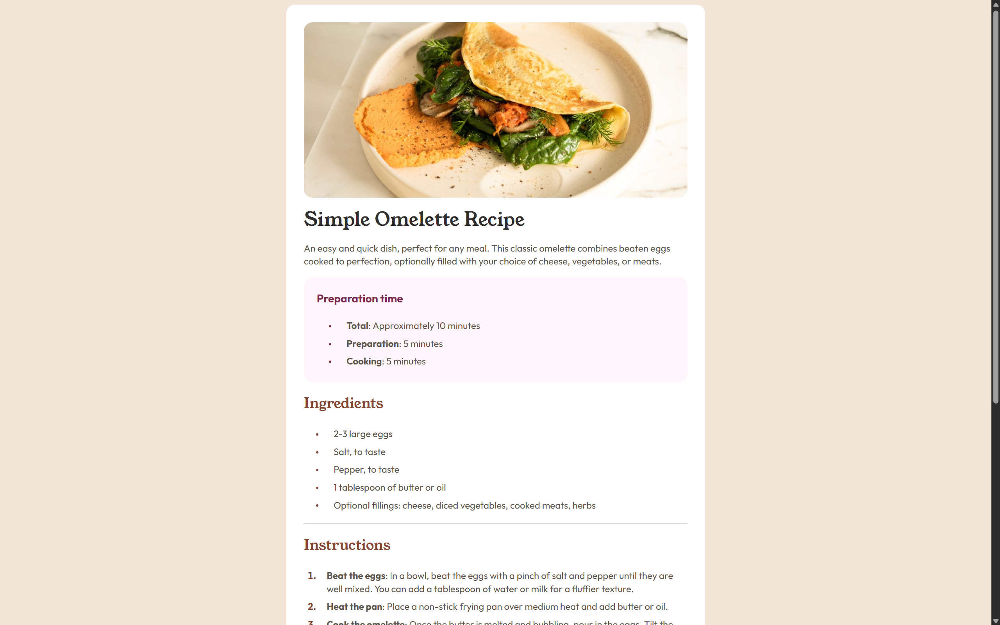

# Frontend Mentor - Recipe page solution

This is a solution to the [Recipe page challenge on Frontend Mentor](https://www.frontendmentor.io/challenges/recipe-page-KiTsR8QQKm). Frontend Mentor challenges help you improve your coding skills by building realistic projects. 

## Table of contents

- [Overview](#overview)
  - [Screenshot](#screenshot)
  - [Links](#links)
- [My process](#my-process)
  - [Built with](#built-with)
  - [What I learned](#what-i-learned)
  - [Useful resources](#useful-resources)

## Overview

Recipe page made with HTML and CSS

### Screenshot

### Links

- [Solution URL](https://www.frontendmentor.io/solutions/recipe-page-mobile-first-workflow-7AfIvZL8kl)
- [Live Site URL](https://josephmoreno.github.io/recipe-page/)

## My process

Focused on mobile design first. Mobile design has white background with all the content composed in a single column.

Structured the HTML, top to bottom: put the image first, header tags (page title, "Preparation Time", "Ingredients", "Instructions", "Nutrition"), unordered and ordered lists, and a table div at the bottom of the page.

Started styling for mobile:
1. Override user-agent margin since the omelette image needs to extend to the edges
2. Added margin for the text area (the rest of the page)
3. "Preparation Time" section has its own div and background color
4. Made the table div at the end of the page a grid
5. Added small details: font family, weight, color, line-height, padding, margin

Desktop design turns the main content into a white background card and the background color behind the card changes.

1. Added border radius to card
2. Added padding to card and removed margin from text area; omelette image becomes centered in card
3. Added border radius to omelette image

### Built with

- Semantic HTML5 markup
- Mobile-first workflow

### What I learned

Small detail with the unordered list: the bullet point is centered vertically with the text.

The default behavior of the unordered list is that the bullet point sticks to the first line of its text; if there are multiple lines of text, by default the bullet point does NOT center vertically.

Had to use the "ul li::before" pseudo-element to create a bullet point, then for "ul li" elements, applied "display: flex" so the bullet point and text become in-line, and "align-items: center" so the bullet point centeres vertically with the text.

### Useful resources

- [::before pseudo-element](https://developer.mozilla.org/en-US/docs/Web/CSS/::before) - Used to vertically center unordered list bullet points
- [::nth-child pseudo-class](https://developer.mozilla.org/en-US/docs/Web/CSS/:nth-child) - Used on table
- [::marker pseudo-element](https://developer.mozilla.org/en-US/docs/Web/CSS/::marker)
